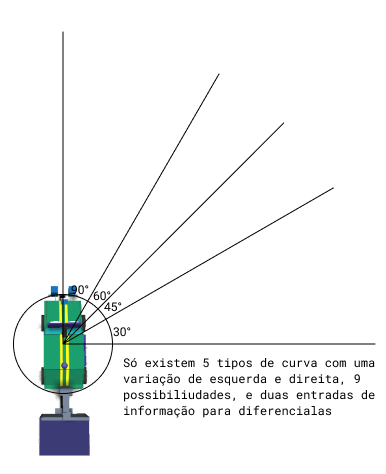
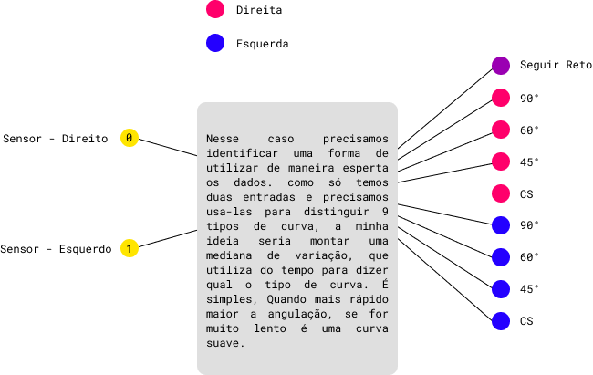

# ANOTAÇÕES OLIMPIADA

### 🚒 OBR - OLIMPIADA BRASILEIRA DE ROBOTICA

$`D = d - e`$ A diferença das direções

```html
**D = Diferença
d = Direita
e = Esquerda**
```





- [ ]  Voltar na marcação verde dupla;
- [ ]  Função de start, que procura a alinha assim que o carro inicia;
- [ ]  Curva de 90° com marcação verde e falha de linha;
- [ ]  Identificar fim da área de resgate, marcação verde;
- [ ]  Marcação vermelha, final do percurso. Parar cinco segundos;
- [ ]  Boas praticas de organização de código;
- [ ]  Arena de resgate;
- [ ]  Volte a linha;
- [ ]  Distinguir objeto de rampa.

### Funções Mortas:

```csharp
float[] sens = {
    bc.Lightness(0), bc.Lightness(1), bc.Lightness(2), bc.Lightness(3), bc.Lightness(4), bc.Lightness(5)
};
int count = 0;
//AJUSTE DE CURVAS SUAVES
Func<int> ajusteFino = () =>
{
    float mediana = (sens[1] + sens[2] + 40) / 2;
    float error = 40 - mediana;
    bc.MoveFrontal(50 - 15 * error, 50 + 15 * error);

    return 0;
};
```